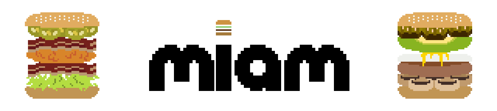
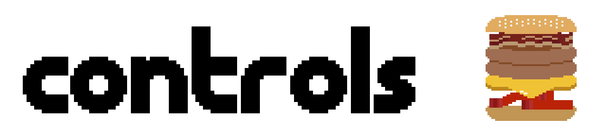

 

miam is a cooking game in which you have to make burgers by pressing the letters corresponding to the ingredients.
However, the chef keeps changing his mind and changes the menu every 10 seconds!

Minor spoilers below! The key corresponding to an ingredient is written around brackets `[]`.

- Title screen:
  - [c] Classic mode (start with a basic menu)
  - [d] Madness mode (start with a full menu and less time to prepare burgers)
  - [u] Mute / unmute the music
- Cooking screen:
  - The key associated with each ingredient is shown in the menu on the left of the screen (and also on this page)
  - [space] / [enter] Send the order
  - [backspace] Remove placed ingredients

- **yopox** ([twitter](https://www.twitter.com/yopoxdev), [github](https://github.com/yopox)): code, graphics
- **hadri** ([github](https://github.com/HadrienRenaud)): code
- **on100balec** ([youtube](https://www.youtube.com/user/ArtRemix)): background music and sound effects

We have used the following tools:
- CLion 2022.3 EAP
- Rust & Bevy engine
- Aseprite
- Ableton Live 11